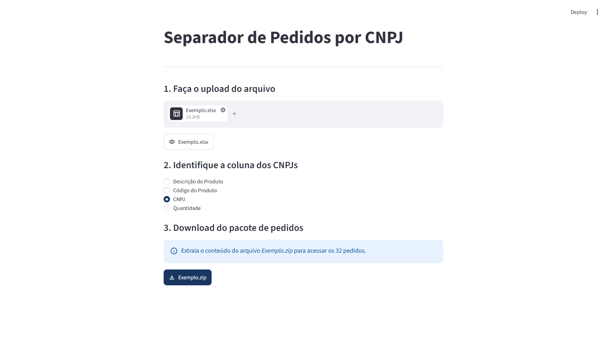

# Separador de Pedidos por CNPJ

&nbsp;&nbsp;
&nbsp;&nbsp;

Aplicação web desenvolvida em Streamlit para apoiar o processo operacional da área comercial de uma distribuidora de medicamentos e produtos de higiene e beleza.

🔗 **Acesse a aplicação:** [separador-pedidos-cnpj.streamlit.app](https://separador-pedidos-cnpj.streamlit.app/)

## Funcionamento

1. **Upload do arquivo**: O usuário envia uma planilha contendo os pedidos. A aplicação aceita arquivos nos formatos XLSX, XLS e XML, com limite de 200 MB por arquivo.

2. **Seleção da coluna do CNPJ**: A aplicação identifica automaticamente a coluna que contém os CNPJs. Caso a identificação não seja possível, o usuário pode selecionar manualmente a coluna correta.

3. **Processamento**: A aplicação separa os registros por CNPJ e gera um arquivo ZIP contendo os arquivos individuais prontos para importação no sistema de pedidos eletrônicos.

## Privacidade

Os arquivos enviados são utilizados apenas durante o processamento. A aplicação **não** mantém histórico dos arquivos enviados nem dos resultados gerados.