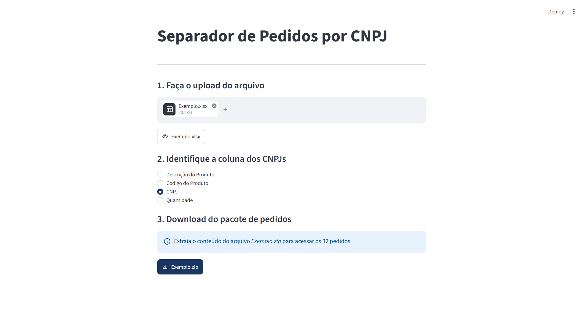

# Separador de Pedidos por CNPJ

&nbsp;&nbsp;
&nbsp;&nbsp;

Aplicação web desenvolvida em Streamlit para apoiar a rotina comercial de uma distribuidora de medicamentos e produtos de higiene e beleza.

🔗 **Acesse a aplicação:** [separador-pedidos-cnpj.streamlit.app](https://separador-pedidos-cnpj.streamlit.app/)

## Contexto

Na rotina comercial, é comum que os pedidos cheguem consolidados em uma única planilha, com registros de vários CNPJs. No entanto, o sistema de pedidos eletrônico exige um arquivo individual para cada CNPJ. Como o volume de pedidos pode ser alto, separá-los manualmente demanda tempo e aumenta o risco de erros. A aplicação automatiza a separação e prepara os arquivos para importação.

## Funcionamento

1. **Upload do arquivo**: O usuário envia uma planilha contendo os pedidos. A aplicação aceita arquivos nos formatos XLSX e XLS, com limite de 200 MB por arquivo.

2. **Seleção da coluna do CNPJ**: A aplicação sugere uma coluna com base no nome do cabeçalho, e o usuário pode selecionar manualmente a coluna correta.

3. **Processamento**: A aplicação separa os registros por CNPJ e gera um arquivo ZIP com uma planilha XLSX para cada CNPJ. Extraia os arquivos do ZIP antes de importá-los no sistema de pedidos eletrônico.

## Privacidade

Os dados são processados em memória e podem permanecer no cache do Streamlit por até cinco minutos. A aplicação não grava os dados em armazenamento persistente.